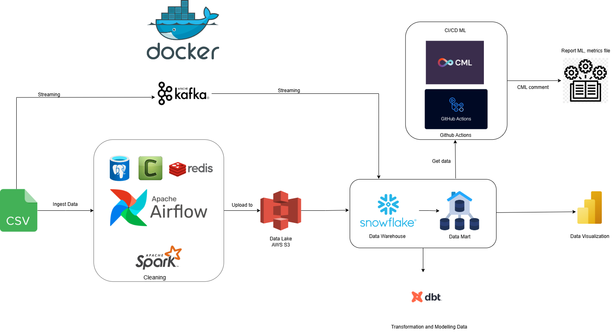
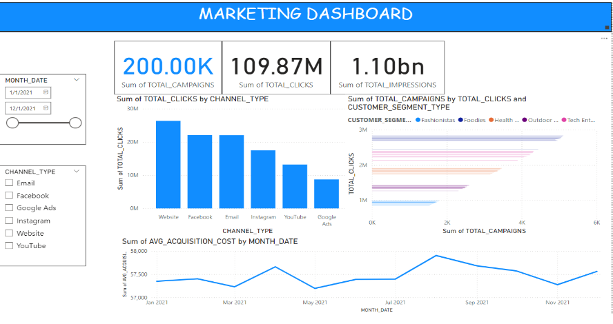
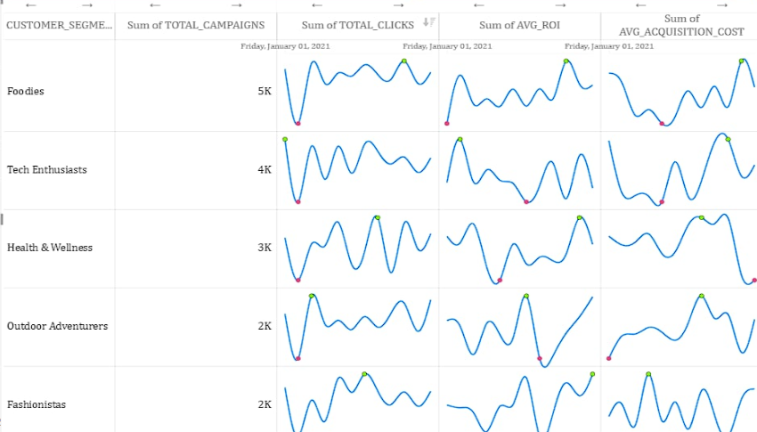

# 📊 Marketing Campaign Data Pipeline

This repository contains a data pipeline designed to handle the ingestion, transformation, and visualization of marketing campaign data. The pipeline leverages modern data engineering tools to ensure efficient processing and management of streaming and batch data.

---

## 🗺️ Architecture Overview



The pipeline integrates the following components:

1. **🐳 Docker**: Provides containerization for all pipeline components, ensuring consistency and scalability across environments.
2. **🔗 Apache Kafka**: Used for streaming data ingestion, enabling real-time data processing.
3. **🌀 Apache Airflow**: Orchestrates data ingestion, cleaning, and processing tasks.
4. **⚡ Apache Spark**: Handles large-scale data cleaning and transformations.
5. **☁️ AWS S3**: Acts as the data lake for intermediate storage of raw and processed data.
6. **❄️ Snowflake**: Serves as the primary data warehouse for structured data storage.
7. **📊 dbt (Data Build Tool)**: Facilitates transformation and modeling of data in Snowflake to build a refined Data Mart.
8. **📈 Power BI**: Visualizes marketing campaign metrics and insights for decision-making.
9. **🤖 GitHub Actions and CML**: Implements CI/CD pipelines for machine learning (ML) workflows.

---

## 🎯 Features

- **📡 Streaming Data Processing**: Real-time ingestion and processing of campaign data using Kafka.
- **⚙️ Scalable Orchestration**: Airflow orchestrates data workflows efficiently.
- **💾 Data Lake Integration**: Stores raw and processed data for further use.
- **🛠️ Advanced Transformations**: Snowflake and dbt enable comprehensive data transformations and modeling.
- **🤖 ML Automation**: CI/CD workflows with GitHub Actions and CML support ML metric tracking and reporting.
- **📊 Interactive Dashboards**: Power BI provides actionable insights via dashboards.

---

## 🧑‍💻 Prerequisites

Ensure you have the following installed:

- **Docker** (for containerization)
- **Python 3.8+**
- **AWS S3 Bucket Access**
- **Snowflake Account**
- **Power BI** (for data visualization)

---

## 🚀 Setup Instructions

### Step 1: Clone the Repository
```bash
git clone <repository-url>
cd <repository-directory>
```

### Step 2: Build and Start with Docker Compose
```bash
docker-compose up
```

### Step 3: Configure Environment Variables
Ensure your `.env` file includes necessary configurations for:
- Airflow
- Snowflake
- AWS Credentials

### Step 4: Run Airflow DAGs
- Access the Airflow UI at `http://localhost:8080` and trigger the desired DAGs.

### Step 5: 📊 Run dbt Transformations
- Ensure dbt is properly installed:
   ```bash
   pip install dbt
   ```
- Initialize the dbt project (if not already set up):
   ```bash
   dbt init
   ```
- Run dbt models and transformations:
   ```bash
   dbt run
   ```
- Test dbt models for quality checks:
   ```bash
   dbt test
   ```

### Step 6: 📈 Visualize Data in Power BI
- Open **Power BI Desktop**.
- Connect to your Snowflake data warehouse using the provided credentials.
- Import the transformed data from the Data Mart.
- Create dashboards to visualize the marketing campaign data.

**Example Dashboard:**


---


## 🤝 Contributing

We welcome contributions! Please follow the [contributing guidelines](./CONTRIBUTING.md) and ensure all changes are tested before submitting a pull request.

---

## 📜 License

This project is licensed under the MIT License. See the [LICENSE](./LICENSE) file for details.
